# Museoteca

## 👥 Miembros del Equipo
| Nombre y Apellidos | Correo URJC | Usuario GitHub |
|:--- |:--- |:--- |
| Adrián Villalba Cuello de Oro | a.villalba.2023@alumnos.urjc.es | AdrianVillalba26 |

---

## 🎭 **Preparación 1: Definición del Proyecto**

### **Descripción del Tema**
Aplicación sobre una web informativa de un museo. Los usuarios que acceden a la página pueden seleccionar una de las categorías disponibles en la web, de manera que se muestran todos los objetos que posee el museo de dicha categoría. Además de esto, el usuario puede elegir uno de los objetos mostrados de la categoría seleccionada para consultar información de interés acerca del objeto. La finalidad de esta web es que los usuarios puedan aprender y conocer en mayor profundidad la colección del museo de una manera interactiva, sencilla y accesible mediante una experiencia digital intuitiva y educativa.

### **Entidades**
Indicar las entidades principales que gestionará la aplicación y las relaciones entre ellas:

1. **Usuario**: Persona que entra a la aplicación web del museo.
2. **Objeto**: Pieza o elemento que forma parte de la colección del museo y que pertenece a una sección determinada.
3. **Nota**: Anotación que un usuario puede dejar en un objeto.

**Relaciones entre entidades:**
- Usuario - Objeto: Un usuario puede consultar varios objetos, y un objeto puede ser consultado por varios usuarios (N:M). 
- Usuario - Nota: Un usuario puede dejar varias notas, pero cada nota pertenece a un único usuario (1:N).
- Objeto - Nota: Un objeto puede contener varias notas, pero cada nota está asociada a un único objeto (1:N).

### **Permisos de los Usuarios**
Describir los permisos de cada tipo de usuario e indicar de qué entidades es dueño:

* **Usuario Anónimo**: 
  - Permisos: Puede acceder a una sección, entrar a la página informativa de un objeto y realizar búsquedas.
  - No es dueño de ninguna entidad.

* **Usuario Registrado**: 
  - Permisos: 
  
      -> Puede acceder a una sección, entrar a la página informativa de un objeto y realizar búsquedas usando filtros.  
      -> Puede marcar o desmarcar un objeto como visto, y también puede marcar un objeto como favorito, guardando dicho objeto en una lista de favoritos que posee, o desmascarlo.  
      -> Puede dejar una o varias notas en la página informativa de un objeto.  
      -> Puede editar su perfil de usuario.
  - Es dueño de: Su perfil de usuario, los objetos que marca como vistos, los objetos que marca como favoritos y las notas que deja en un objeto.

* **Administrador**: 
  - Permisos: 
  
      -> Puede añadir o eliminar una sección.  Puede añadir o eliminar un objeto tras acceder a una sección (editar una sección).  
      -> Puede editar un objeto desde la página informativa de este (cambiar foto, nombre o descripción del objeto, además de poder añadir o eliminar una nota).
  - Es dueño de: Las secciones que muestra el museo en la web, los objetos que muestra cada sección, los datos e imágenes de cada objeto, y las notas que dejan los usuarios. No puede crear ni eliminar usuarios, ni tampoco editar sus datos personales.

### **Imágenes**
Indicar qué entidades tendrán asociadas una o varias imágenes:

- **Usuario**: Una imagen en el perfil, que el usuario puede cambiar por otra o quitarla si lo desea.
- **Objeto**: Cada objeto tiene una imagen junto a su descripción en la página informativa de dicho objeto. La misma imagen también aparece en el objeto localizado en la lista de objetos que se muestra tras acceder a una sección.

### **Gráficos**
Indicar qué información se mostrará usando gráficos y de qué tipo serán:

- **Gráfico 1**: Gráfico que muestra cómo se distribuye el total de objetos entre las diferentes secciones (Gráfico de tarta / circular).
- **Gráfico 2**: Gráfico que representa el número de objetos favoritos que tiene el usuario por cada sección (Gráfico de barras).

### **Algoritmo o Consulta Avanzada**
Indicar cuál será el algoritmo o consulta avanzada que se implementará:

- **Algoritmo/Consulta**: Cálculo del porcentaje de progreso del usuario por sección.
- **Descripción**: El sistema calcula el porcentaje de objetos que un usuario registrado ha marcado como "vistos" dentro de cada sección del museo.
- **Alternativa**: Determinar la sección favorita del usuario calculando el número de objetos marcados como favoritos en cada sección. Si coinciden varias secciones como las favoritas del usuario, se muestran todas las que coincidan.

---

## 🛠 **Práctica 1: Web con HTML generado en servidor y AJAX**

### **Vídeo de Demostración**
📹 **[Enlace al vídeo en YouTube](https://www.youtube.com/watch?v=x91MPoITQ3I)**
> Vídeo mostrando las principales funcionalidades de la aplicación web.

### **Navegación y Capturas de Pantalla**

#### **Diagrama de Navegación**

Diagrama que muestra cómo se navega entre las diferentes páginas de la aplicación:

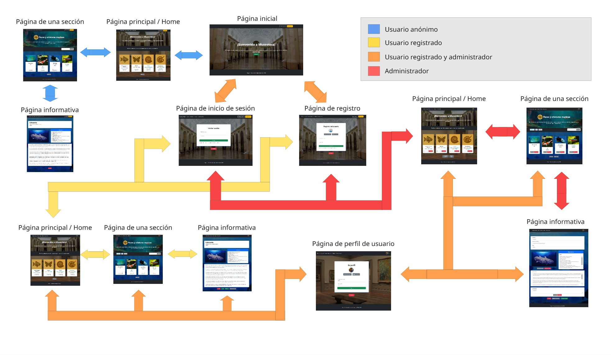

> El usuario accede a la página inicial de la aplicación. A continuación, puede decidir si quiere entrar como usuario anónimo, iniciar sesión o registrarse tanto como usuario registrado como administrador.

> - El usuario anónimo, tras pasar la página inicial, llega a la página principal o home en la versión de usuario anónimo, donde, tras seleccionar una sección, le aparece la página de la sección elegida. En dicha página, si selecciona un elemento de los disponibles, pasa a estar en la página informativa del elemento seleccionado.

> - El usuario que ha iniciado sesión o se ha registrado (tanto como usuario normal como usuario administrador), puede hacer las mismas acciones que el usuario anónimo, más algunas adicionales dependiendo del rol.
Junto a esto, puede consultar su perfil de usuario desde la página principal o home, desde la página de una sección o desde la página informativa.


#### **Capturas de Pantalla Actualizadas**

#### **1. Página inicial**
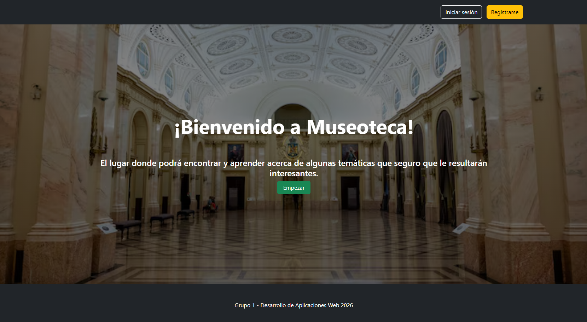

> Página de inicio de la aplicación. En la página, se te da la opción de iniciar sesión, registrarte, o acceder a la web como usuario anónimo. Si accedes como usuario anónimo, arriba se seguirá mostrando las opciones de inicio de sesión y de registro en todas las páginas por las que navegues.

#### **2. Página de registro**
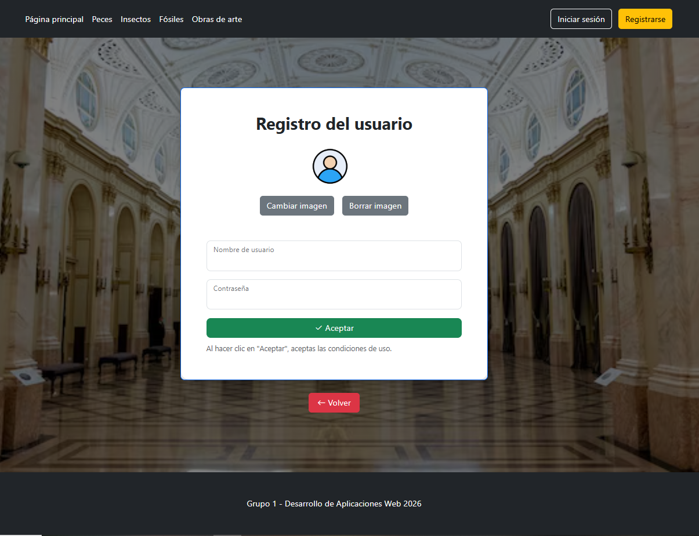

> Página que se muestra tras haber pulsado la opción "Registrarse" en la barra superior. Se debe poner un nombre de usuario y una contraseña; opcionalmente, se puede poner también una imagen o foto de perfil. Tras esto, al pulsar en "Aceptar" quedas registrado en la aplicación.

#### **3. Página de inicio de sesión**
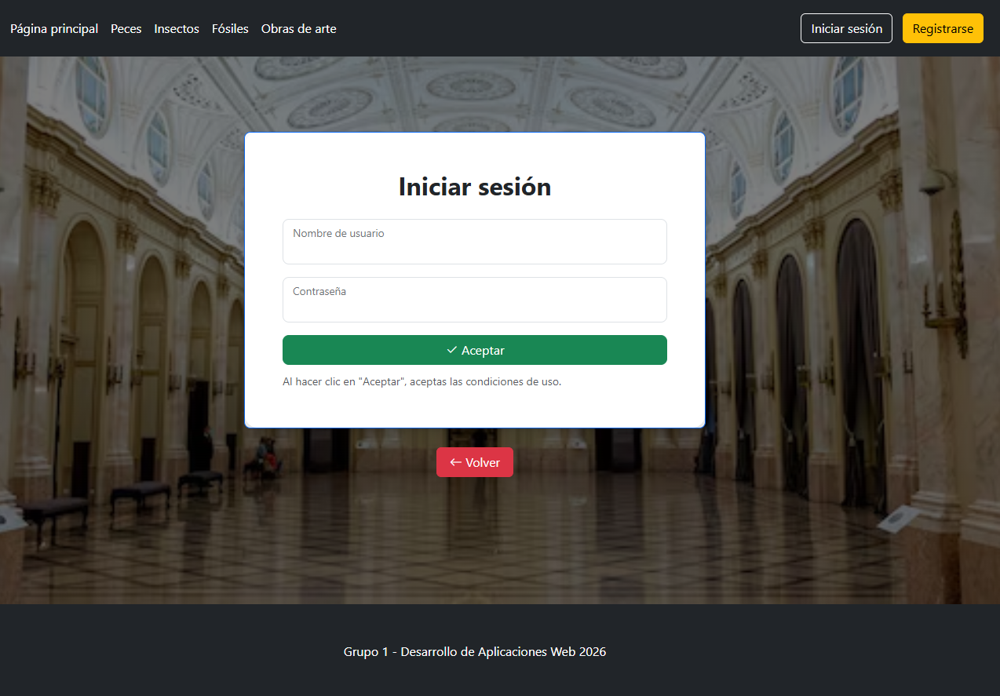

> Página que se muestra tras haber pulsado la opción "Iniciar sesión" en la barra superior. Se debe poner un nombre de usuario y una contraseña para poder iniciar tu sesión en la aplicación. 

#### **4. Página principal / Home**

#### **- Página de usuario anónimo**
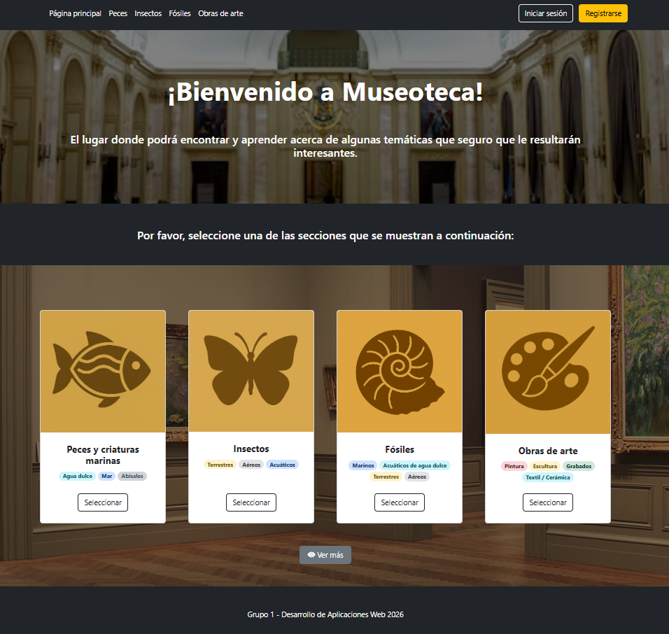

> Página que se muestra tras haber pasado la página inicial. En ella, se pueden elegir diferentes secciones temáticas del museo, tanto seleccionando una de las ventanas con los logos representativos, como en las opciones de la barra superior. También se pueden consultar otras secciones que no están visibles en la página (opción "Ver más").

#### **- Página de usuario registrado**
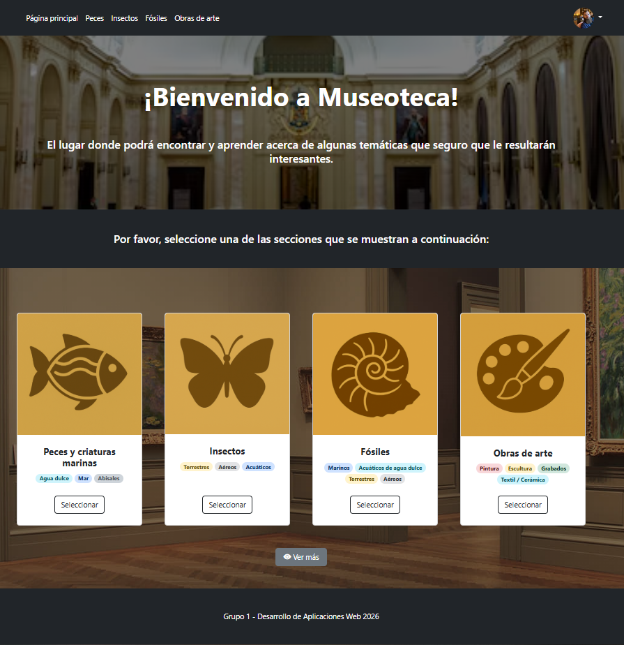

#### **- Página del administrador**
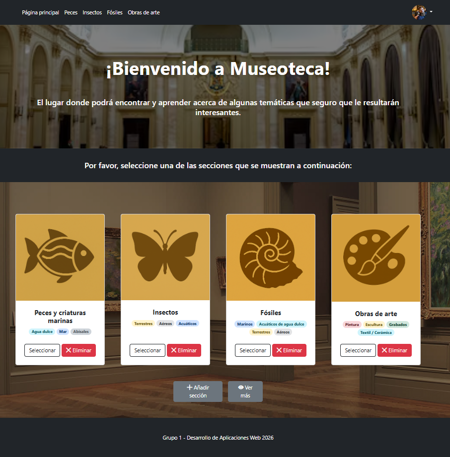

> Página que se muestra tras haber pasado la página inicial. En ella, se pueden elegir diferentes secciones temáticas del museo, tanto seleccionando una de las ventanas con los logos representativos, como en las opciones de la barra superior. También se pueden consultar otras secciones que no están visibles en la página (opción "Ver más").

#### **5. Página de una sección**

#### **- Página de usuario anónimo**
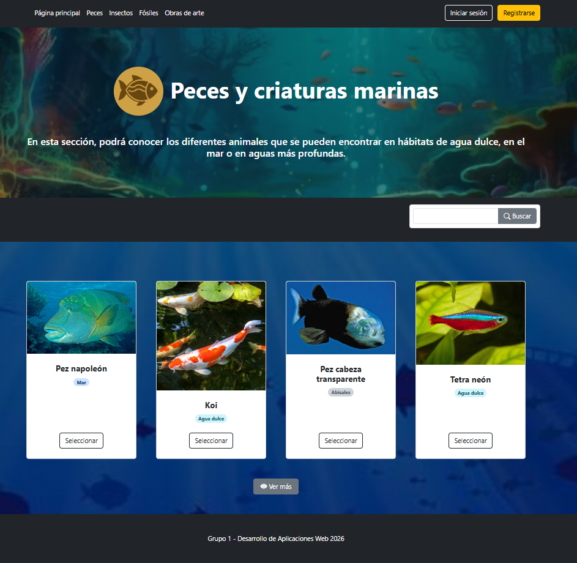

> Página que se muestra tras haber seleccionado una sección de las disponibles en la página principal. El usuario puede usar la barra de búsqueda, seleccionar uno de los elementos que se muestran en la página o consultar otros elementos que no están visibles en la página (opción "Ver más").

#### **- Página de usuario registrado**


> Además de lo que puede hacer el usuario anónimo, se pueden buscar elementos por tipos pulsando en los botones disponibles (agua dulce, mar o abisales).

#### **- Página del administrador**
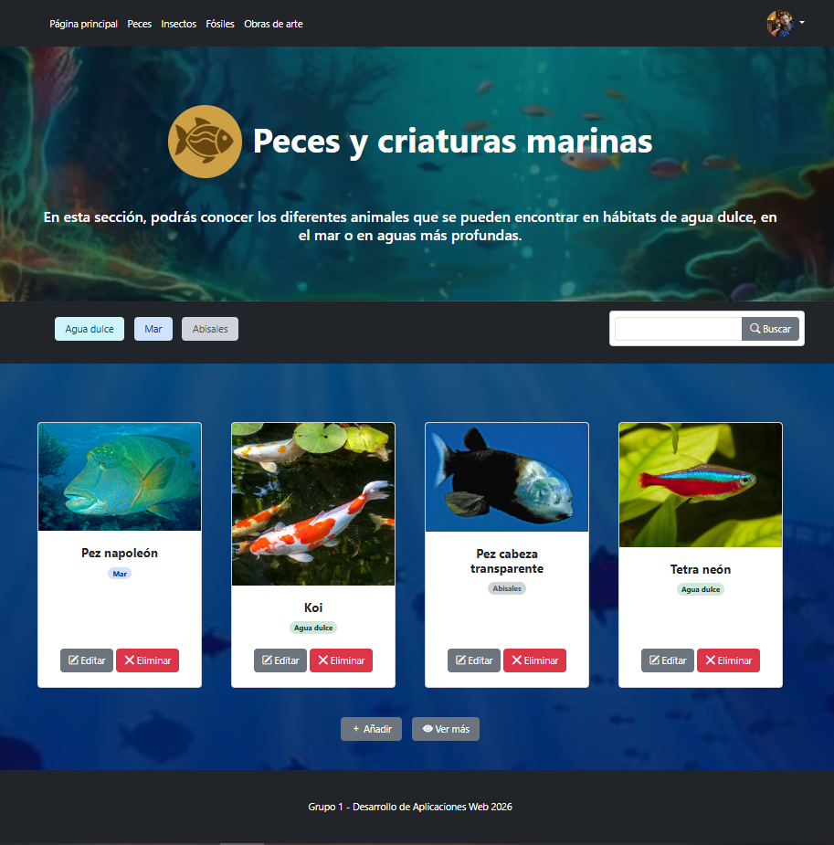

> Se puede además añadir un elemento, y editar o eliminar uno de los disponibles.

#### **6. Página informativa**
#### **- Página de usuario anónimo**
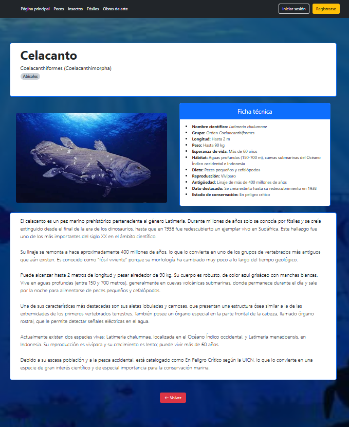

> Página que se muestra tras haber seleccionado un elemento de los disponibles en la página de la sección. El usuario puede consultar información de interés acerca del elemento que ha seleccionado previamente. 
#### **- Página de usuario registrado**
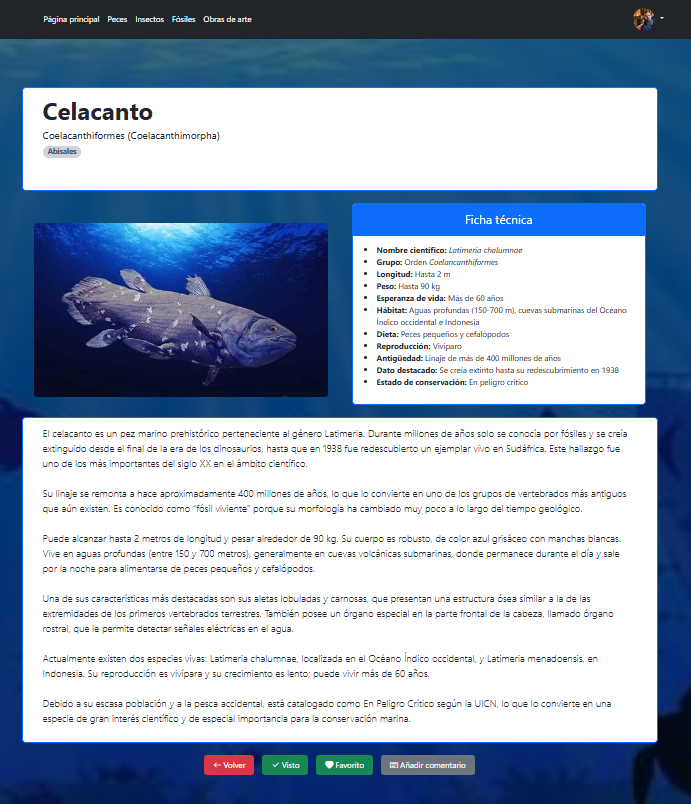

> Además de lo que puede hacer el usuario anónimo, se puede marcar como visto el elemento, marcarlo como favorito o añadir un comentario en la página informativa. 

#### **- Página del administrador**
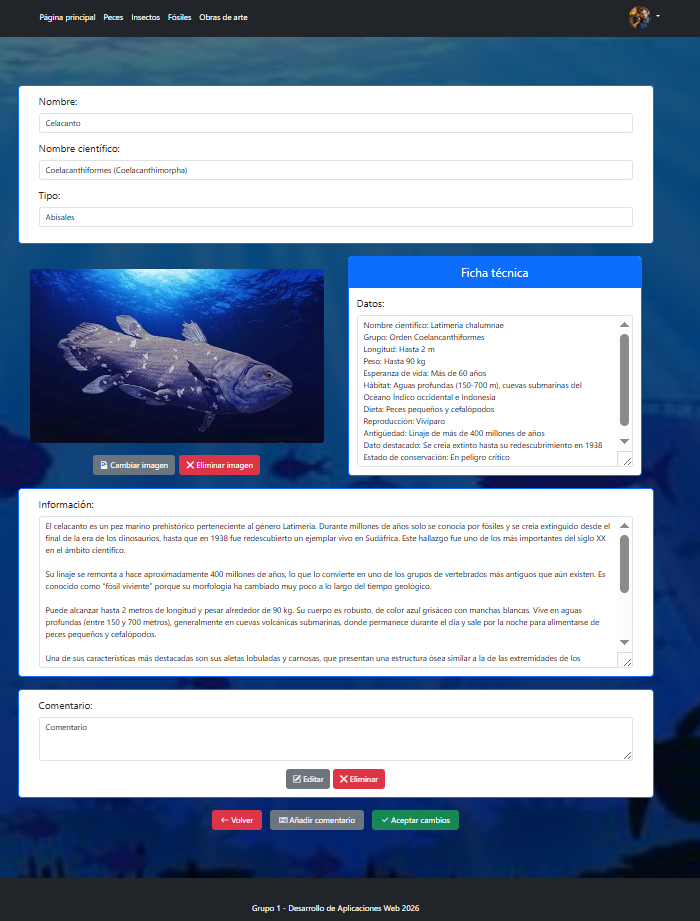

> Accede directamente a la página informativa donde puede modificar lo que desee de ella. 

#### **-> Para las siguientes páginas, se accede a ellas pulsando una opción de las que hay en el menú desplegable del perfil:**

#### **7. Página de perfil de usuario**
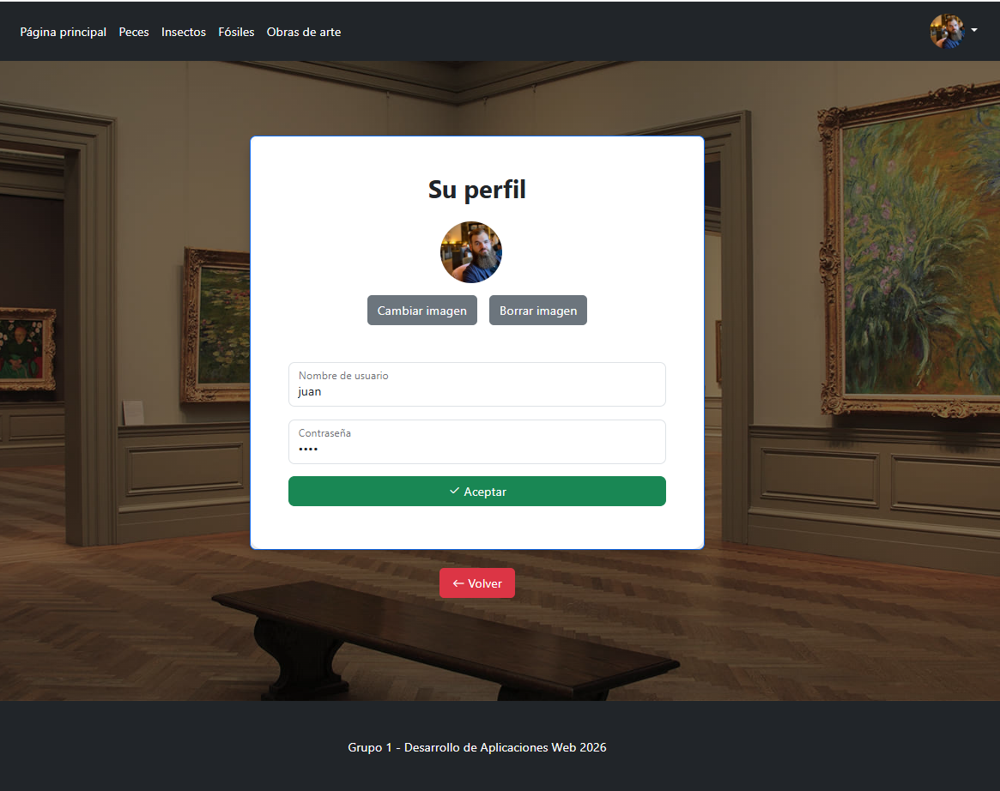

> Página que muestra tu perfil de usuario actual, el cual puedes editar si lo deseas.

### **Instrucciones de Ejecución**

#### **Requisitos Previos**
- **Java**: versión 21 o superior
- **Maven**: versión 3.8 o superior
- **MySQL**: versión 8.0 o superior
- **Git**: para clonar el repositorio

#### **Pasos para ejecutar la aplicación**

1. **Clonar el repositorio**
   ```bash
   git clone https://github.com/[usuario]/[nombre-repositorio].git
   cd [nombre-repositorio]
   ```

2. **AQUÍ INDICAR LO SIGUIENTES PASOS**

#### **Credenciales de prueba**
- **Usuario Admin**: usuario: `admin`, contraseña: `admin`
- **Usuario Registrado**: usuario: `user`, contraseña: `user`

### **Diagrama de Entidades de Base de Datos**

Diagrama mostrando las entidades, sus campos y relaciones:


> [Descripción opcional: Ej: "El diagrama muestra las 4 entidades principales: Usuario, Producto, Pedido y Categoría, con sus respectivos atributos y relaciones 1:N y N:M."]

### **Diagrama de Clases y Templates**

Diagrama de clases de la aplicación con diferenciación por colores o secciones:


> [Descripción opcional del diagrama y relaciones principales]

---

## 🛠 **Práctica 2: Incorporación de una API REST a la aplicación web, despliegue con Docker y despliegue remoto**

### **Vídeo de Demostración**
📹 **[Enlace al vídeo en YouTube](https://www.youtube.com/watch?v=x91MPoITQ3I)**
> Vídeo mostrando las principales funcionalidades de la aplicación web.

### **Documentación de la API REST**

#### **Especificación OpenAPI**
📄 **[Especificación OpenAPI (YAML)](/api-docs/api-docs.yaml)**

#### **Documentación HTML**
📖 **[Documentación API REST (HTML)](https://raw.githack.com/[usuario]/[repositorio]/main/api-docs/api-docs.html)**

> La documentación de la API REST se encuentra en la carpeta `/api-docs` del repositorio. Se ha generado automáticamente con SpringDoc a partir de las anotaciones en el código Java.

### **Diagrama de Clases y Templates Actualizado**

Diagrama actualizado incluyendo los @RestController y su relación con los @Service compartidos:


### **Instrucciones de Ejecución con Docker**

#### **Requisitos previos:**
- Docker instalado (versión 20.10 o superior)
- Docker Compose instalado (versión 2.0 o superior)

#### **Pasos para ejecutar con docker-compose:**

1. **Clonar el repositorio** (si no lo has hecho ya):
   ```bash
   git clone https://github.com/[usuario]/[repositorio].git
   cd [repositorio]
   ```

2. **AQUÍ LOS SIGUIENTES PASOS**:

### **Construcción de la Imagen Docker**

#### **Requisitos:**
- Docker instalado en el sistema

#### **Pasos para construir y publicar la imagen:**

1. **Navegar al directorio de Docker**:
   ```bash
   cd docker
   ```

2. **AQUÍ LOS SIGUIENTES PASOS**

### **Despliegue en Máquina Virtual**

#### **Requisitos:**
- Acceso a la máquina virtual (SSH)
- Clave privada para autenticación
- Conexión a la red correspondiente o VPN configurada

#### **Pasos para desplegar:**

1. **Conectar a la máquina virtual**:
   ```bash
   ssh -i [ruta/a/clave.key] [usuario]@[IP-o-dominio-VM]
   ```
   
   Ejemplo:
   ```bash
   ssh -i ssh-keys/app.key vmuser@10.100.139.XXX
   ```

2. **AQUÍ LOS SIGUIENTES PASOS**:

### **URL de la Aplicación Desplegada**

🌐 **URL de acceso**: `https://[nombre-app].etsii.urjc.es:8443`

#### **Credenciales de Usuarios de Ejemplo**

| Rol | Usuario | Contraseña |
|:---|:---|:---|
| Administrador | admin | admin123 |
| Usuario Registrado | user1 | user123 |
| Usuario Registrado | user2 | user123 |

### **Participación de Miembros en la Práctica 2**

#### **Alumno 1 - [Nombre Completo]**

[Descripción de las tareas y responsabilidades principales del alumno en el proyecto]

| Nº    | Commits      | Files      |
|:------------: |:------------:| :------------:|
|1| [Descripción commit 1](URL_commit_1)  | [Archivo1](URL_archivo_1)   |
|2| [Descripción commit 2](URL_commit_2)  | [Archivo2](URL_archivo_2)   |
|3| [Descripción commit 3](URL_commit_3)  | [Archivo3](URL_archivo_3)   |
|4| [Descripción commit 4](URL_commit_4)  | [Archivo4](URL_archivo_4)   |
|5| [Descripción commit 5](URL_commit_5)  | [Archivo5](URL_archivo_5)   |

---

#### **Alumno 2 - [Nombre Completo]**

[Descripción de las tareas y responsabilidades principales del alumno en el proyecto]

| Nº    | Commits      | Files      |
|:------------: |:------------:| :------------:|
|1| [Descripción commit 1](URL_commit_1)  | [Archivo1](URL_archivo_1)   |
|2| [Descripción commit 2](URL_commit_2)  | [Archivo2](URL_archivo_2)   |
|3| [Descripción commit 3](URL_commit_3)  | [Archivo3](URL_archivo_3)   |
|4| [Descripción commit 4](URL_commit_4)  | [Archivo4](URL_archivo_4)   |
|5| [Descripción commit 5](URL_commit_5)  | [Archivo5](URL_archivo_5)   |

---

#### **Alumno 3 - [Nombre Completo]**

[Descripción de las tareas y responsabilidades principales del alumno en el proyecto]

| Nº    | Commits      | Files      |
|:------------: |:------------:| :------------:|
|1| [Descripción commit 1](URL_commit_1)  | [Archivo1](URL_archivo_1)   |
|2| [Descripción commit 2](URL_commit_2)  | [Archivo2](URL_archivo_2)   |
|3| [Descripción commit 3](URL_commit_3)  | [Archivo3](URL_archivo_3)   |
|4| [Descripción commit 4](URL_commit_4)  | [Archivo4](URL_archivo_4)   |
|5| [Descripción commit 5](URL_commit_5)  | [Archivo5](URL_archivo_5)   |

---

#### **Alumno 4 - [Nombre Completo]**

[Descripción de las tareas y responsabilidades principales del alumno en el proyecto]

| Nº    | Commits      | Files      |
|:------------: |:------------:| :------------:|
|1| [Descripción commit 1](URL_commit_1)  | [Archivo1](URL_archivo_1)   |
|2| [Descripción commit 2](URL_commit_2)  | [Archivo2](URL_archivo_2)   |
|3| [Descripción commit 3](URL_commit_3)  | [Archivo3](URL_archivo_3)   |
|4| [Descripción commit 4](URL_commit_4)  | [Archivo4](URL_archivo_4)   |
|5| [Descripción commit 5](URL_commit_5)  | [Archivo5](URL_archivo_5)   |

---

## 🛠 **Práctica 3: Implementación de la web con arquitectura SPA**

### **Vídeo de Demostración**
📹 **[Enlace al vídeo en YouTube](URL_del_video)**
> Vídeo mostrando las principales funcionalidades de la aplicación web.

### **Preparación del Entorno de Desarrollo**

#### **Requisitos Previos**
- **Node.js**: versión 18.x o superior
- **npm**: versión 9.x o superior (se instala con Node.js)
- **Git**: para clonar el repositorio

#### **Pasos para configurar el entorno de desarrollo**

1. **Instalar Node.js y npm**
   
   Descarga e instala Node.js desde [https://nodejs.org/](https://nodejs.org/)
   
   Verifica la instalación:
   ```bash
   node --version
   npm --version
   ```

2. **Clonar el repositorio** (si no lo has hecho ya)
   ```bash
   git clone https://github.com/[usuario]/[nombre-repositorio].git
   cd [nombre-repositorio]
   ```

3. **Navegar a la carpeta del proyecto React**
   ```bash
   cd frontend
   ```

4. **AQUÍ LOS SIGUIENTES PASOS**

### **Diagrama de Clases y Templates de la SPA**

Diagrama mostrando los componentes React, hooks personalizados, servicios y sus relaciones:


### **Participación de Miembros en la Práctica 3**

#### **Alumno 1 - [Nombre Completo]**

[Descripción de las tareas y responsabilidades principales del alumno en el proyecto]

| Nº    | Commits      | Files      |
|:------------: |:------------:| :------------:|
|1| [Descripción commit 1](URL_commit_1)  | [Archivo1](URL_archivo_1)   |
|2| [Descripción commit 2](URL_commit_2)  | [Archivo2](URL_archivo_2)   |
|3| [Descripción commit 3](URL_commit_3)  | [Archivo3](URL_archivo_3)   |
|4| [Descripción commit 4](URL_commit_4)  | [Archivo4](URL_archivo_4)   |
|5| [Descripción commit 5](URL_commit_5)  | [Archivo5](URL_archivo_5)   |

---

#### **Alumno 2 - [Nombre Completo]**

[Descripción de las tareas y responsabilidades principales del alumno en el proyecto]

| Nº    | Commits      | Files      |
|:------------: |:------------:| :------------:|
|1| [Descripción commit 1](URL_commit_1)  | [Archivo1](URL_archivo_1)   |
|2| [Descripción commit 2](URL_commit_2)  | [Archivo2](URL_archivo_2)   |
|3| [Descripción commit 3](URL_commit_3)  | [Archivo3](URL_archivo_3)   |
|4| [Descripción commit 4](URL_commit_4)  | [Archivo4](URL_archivo_4)   |
|5| [Descripción commit 5](URL_commit_5)  | [Archivo5](URL_archivo_5)   |

---

#### **Alumno 3 - [Nombre Completo]**

[Descripción de las tareas y responsabilidades principales del alumno en el proyecto]

| Nº    | Commits      | Files      |
|:------------: |:------------:| :------------:|
|1| [Descripción commit 1](URL_commit_1)  | [Archivo1](URL_archivo_1)   |
|2| [Descripción commit 2](URL_commit_2)  | [Archivo2](URL_archivo_2)   |
|3| [Descripción commit 3](URL_commit_3)  | [Archivo3](URL_archivo_3)   |
|4| [Descripción commit 4](URL_commit_4)  | [Archivo4](URL_archivo_4)   |
|5| [Descripción commit 5](URL_commit_5)  | [Archivo5](URL_archivo_5)   |

---

#### **Alumno 4 - [Nombre Completo]**

[Descripción de las tareas y responsabilidades principales del alumno en el proyecto]

| Nº    | Commits      | Files      |
|:------------: |:------------:| :------------:|
|1| [Descripción commit 1](URL_commit_1)  | [Archivo1](URL_archivo_1)   |
|2| [Descripción commit 2](URL_commit_2)  | [Archivo2](URL_archivo_2)   |
|3| [Descripción commit 3](URL_commit_3)  | [Archivo3](URL_archivo_3)   |
|4| [Descripción commit 4](URL_commit_4)  | [Archivo4](URL_archivo_4)   |
|5| [Descripción commit 5](URL_commit_5)  | [Archivo5](URL_archivo_5)   |

